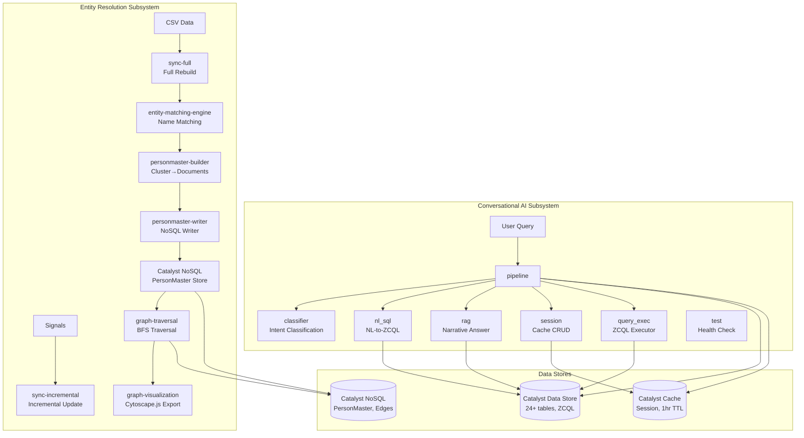

<!-- generated-by: gsd-doc-writer -->
---
title: Architecture
sidebar_position: 2
description: System architecture and component overview for the KSP Crime Analytics Platform
---

# Architecture — KSP Crime Analytics Platform

## System Overview

The KSP Crime Analytics Platform is a conversational AI system that lets investigators, analysts, and policymakers query the Karnataka State Police (KSP) crime database using natural language. It deploys as 13 independent Catalyst AdvancedIO serverless functions (Node.js 24) on **Zoho Catalyst** — a mandatory constraint per Datathon 2026 rules. The architecture follows a **function-oriented serverless model**: each Catalyst function is an independently deployed HTTP endpoint using the raw Node.js `http` module (`IncomingMessage`, `ServerResponse`), with no Express/Koa/Fastify framework. Functions communicate through the Catalyst Data Store (ZCQL), Cache (session memory), and QuickML (GLM LLM) — there is no inter-function HTTP calling. The system comprises two major subsystems: a **Conversational AI subsystem** (7 deployed functions handling NL query → intent classification → SQL generation → result formatting) and an **Entity Resolution & Graph subsystem** (6 deployed functions plus 4 library modules that build and query a person-matching knowledge graph over 481 PersonMaster documents and 7,757 typed edges stored in Catalyst NoSQL).

## System Diagram



## Data Flow — User Query Processing

Every user query follows a defined path through the pipeline function, which acts as the single entry point:

1. **Ingress** — `POST /pipeline/query` receives `{"query": "...", "employee_id": 1, "session_id": "..."}`.
2. **Session Resolution** — The pipeline calls the session handler inline to load or create a Catalyst Cache entry for the employee. This loads the employee's rank hierarchy, unit ID, and district ID (used later for RBAC scope injection).
3. **Intent Classification** — The classifier logic (inline in pipeline, also available as a standalone function) runs a two-stage process:
   - **Stage 1 — Keyword match**: Checks the query against five regex patterns (structured, narrative, network, risk, analytical). Returns intent + confidence immediately if matched.
   - **Stage 2 — GLM fallback**: If no keyword match, sends the query to the GLM LLM (`crm-di-glm47b_30b_it`) with a classification prompt.
4. **Handler Routing** — Based on the classified intent, the pipeline routes to one of five inline handlers:
   - **structured** → `translateToSQL()` → GLM generates ZCQL → `executeSQL()` → ZCQL execution → formatted rows
   - **narrative** → keyword extraction → `BriefFacts LIKE` search → top 3 excerpts to GLM → narrative answer with source references
   - **network** → person name extraction → search Accused/Victim/Complainant tables → build graph nodes + edges → answer with network structure
   - **risk** → person name extraction → count accused cases → compute 0-10 risk score → severity classification (High/Medium/Low)
   - **analytical** → location/time extraction → 3 parallel aggregation queries (crime type breakdown, monthly trend, location breakdown) → trends summary
5. **Response Formatting** — Results are formatted into a standardized JSON envelope (`{status, data: {intent, answer, data, source_refs, confidence, session_id}}`).
6. **Session Persistence** — User and assistant turns are appended to the session in Catalyst Cache (1-hour TTL).

### RBAC Scope Injection

When a query executes ZCQL, the `query_exec.applyScope()` function injects row-level security filters based on the employee's unit and district hierarchy:

- `district_filter` (if present): adds `u.DistrictID = {value}` to WHERE clause
- `unit_filter` (if present): adds `cm.PoliceStationID = {value}` to WHERE clause

The function intelligently inserts these filters before `GROUP BY`, `ORDER BY`, or `LIMIT` clauses, and merges them with existing WHERE conditions via AND. This ensures officers can only see crime data from their jurisdiction — enforced server-side in each ZCQL query.

## Component Architecture

### Conversational AI Subsystem

| # | Function | Entry Point | Role | Calls GLM? | Calls ZCQL? | Lines (approx) |
|---|----------|-------------|------|-----------|-------------|----------------|
| 1 | **test** | `GET /test/` | Health check returning `{"status":"ok"}` | No | No | ~30 |
| 2 | **classifier** | `POST /classifier/classify` | Intent classification — keyword patterns first, GLM fallback for ambiguous queries | Yes (fallback) | No | ~179 |
| 3 | **nl_sql** | `POST /nl_sql/translate` | NL-to-ZCQL translation via GLM, then executes the generated SQL and returns rows | Yes | Yes | ~300 |
| 4 | **rag** | `POST /rag/query` | Keyword extraction → BriefFacts LIKE search → GLM narrative answer with citation | Yes | Yes | ~442 |
| 5 | **pipeline** | `POST /pipeline/query` | Full orchestrator — validates input, classifies intent, routes to inline handler, formats response, persists session | Yes (multiple) | Yes | ~1,244 |
| 6 | **session** | `POST /session/create`, `GET /session/` | Conversation memory CRUD using Catalyst Cache segment with 1-hour TTL | No | Yes (Employee hierarchy) | ~213 |
| 7 | **query_exec** | `POST /query_exec/execute` | Raw ZCQL executor with DDL/DML safety validation and RBAC scope injection | No | Yes | ~132 |

#### Key Implementation Details

**pipeline** (`~1,244 lines`) — The largest function by far. All five intent handlers are implemented **inline** within this single file rather than making HTTP calls to separate functions. This avoids inter-function latency (critical given the 30-second Catalyst timeout) but introduces code duplication: the pipeline has its own copies of `callQuickML()`, `extractGLMContent()`, `searchBriefFacts()`, `translateToSQL()`, and the keyword-based classifier logic. The function also contains the full database schema description (~70 lines) as a prompt template for the GLM.

**classifier** — Supports 5 intents with regex pattern matching:
- `structured`: queries asking for data, counts, lists, FIR details
- `narrative`: queries asking for descriptions, summaries, case details
- `network`: queries about relationships between people, associates
- `risk`: queries about risk scores, dangerous offenders
- `analytical`: queries about predictions, trends, forecasts, patterns

**nl_sql** — Generates ZCQL via GLM, validates it (SELECT only), executes via `app.zcql().executeZCQLQuery()`, and returns SQL, explanation, rows, and column metadata. Includes an **auto-retry** mechanism: if ZCQL execution fails (unknown column, missing JOIN), the error is sent back to GLM with a fix prompt (one retry only due to 30s timeout).

**rag** — Uses keyword extraction (lower-case, remove non-alphanumeric, filter stop words and short words, take first 5) then searches `CaseMaster.BriefFacts` with ZCQL `LIKE '*keyword*'` patterns (using ZCQL's `*` wildcard, not `%`). Sends top 3 matching excerpts to GLM for answer generation with CaseMasterID citations.

**query_exec** — The smallest deployed function (~132 lines). Validates SQL against 9 forbidden keywords (DROP, DELETE, INSERT, UPDATE, TRUNCATE, ALTER, CREATE, EXEC, EXECUTE), applies RBAC scope, executes, and returns flattened rows.

### Entity Resolution & Graph Subsystem

This subsystem builds and queries a person-matching knowledge graph that links individuals across cases using name normalisation, phonetic matching, and cluster analysis.

#### Deployed Functions

| Function | Entry Point | Role | Files |
|----------|-------------|------|-------|
| **entity-matching-engine** | Library module | Core matching library — name normalisation, phonetic key generation, blocking, composite scoring, threshold classification | `normaliser.js`, `phonetic.js`, `blocking.js`, `scorer.js`, `threshold.js`, `index.js` |
| **personmaster-writer** | CLI/batch | Batch-writes PersonMaster documents and edges to Catalyst NoSQL | `index.js`, `writer.js`, `validator.js`, `batch.js` |
| **personmaster-api** | `GET /personmaster-api/` | Skeleton HTTP stub — returns 'Hello from index.js', no CRUD handlers | `index.js` |
| **sync-full** | HTTP + cron | Full graph rebuild from CSV → entity matching → cluster construction → document writing → edge building | `index.js`, `pipeline.js`, `cronHandler.js`, `statistics.js` |
| **sync-incremental** | HTTP + signal | Incremental entity signal processing — candidate loading, resolution, document updates, edge updates | `index.js`, `signalHandler.js`, `candidateLoader.js`, `incrementalResolver.js`, `personUpdater.js`, `edgeUpdater.js` |
| **graph-traversal** | Library module | BFS traversal with validation, path finding, degree computation | `index.js`, `bfs.js`, `traversalService.js`, `validation.js`, `pathUtils.js` |

#### Bare Library Modules (not deployed as functions)

| Module | Files | Purpose |
|--------|-------|---------|
| **personmaster-builder** | `index.js`, `clusterBuilder.js`, `documentBuilder.js`, `edgeBuilder.js`, `edgeValidation.js`, `statistics.js` | Cluster construction → PersonMaster documents → typed edges |
| **graph-service** | `index.js`, `graphRepository.js`, `graphService.js`, `cache.js` | Singleton graph data source with repository/service/cache layers |
| **graph-visualization** | `index.js`, `cytoscapeFormatter.js`, `graphExportService.js`, `styleHints.js`, `routes.js` | Cytoscape.js formatter, graph export, style hints (node color/size by role) |
| **network-analysis** | `index.js`, `routes.js`, `validators.js`, `networkAnalysisService.js`, `responseFormatter.js` | Network analysis routes, validators, response formatting |

#### Entity Resolution Flow

```
CSV Files (Accused.csv, Victim.csv, ComplainantDetails.csv)
    │
    ▼
[sync-full/pipeline.js: Step 1 — Load & Parse]
    ├── Loads all person records from CSVs
    └── Builds CaseMaster lookup (lat/lng)
    │
    ▼
[sync-full/pipeline.js: Step 2 — Pairwise Matching]
    ├── entity-matching-engine/normaliser.js — Name normalisation
    │   ├── Kannada transliteration (base consonants, vowel signs)
    │   ├── English normalisation (lowercase, trim, remove honorifics, TitleCase expansion)
    │   └── Hyphenated name splitting ('Kumar-Rao' → 'Kumar', 'Rao')
    ├── entity-matching-engine/phonetic.js — Phonetic key generation
    ├── entity-matching-engine/scorer.js — Composite scoring (5+ score components)
    └── entity-matching-engine/threshold.js — Classification at 0.78 threshold
    │
    ▼
[sync-full/pipeline.js: Step 3 — Cluster]
    ├── personmaster-builder/clusterBuilder.js — Union-Find clustering
    ├── personmaster-builder/documentBuilder.js — PersonMaster document construction
    └── personmaster-builder/edgeBuilder.js — Typed edge construction
    │
    ▼
[sync-full/pipeline.js: Step 4 — Write]
    ├── personmaster-writer/writer.js — Batch NoSQL insert (Catalyst NoSQL)
    └── Output: 481 PersonMaster documents, 7,757 typed edges
```

#### Entity Matching Engine — Thresholds

| Classification | Score Range | Meaning |
|---------------|-------------|---------|
| **CONFIRMED** | >= 0.78 | High-confidence match — merged into same cluster |
| **UNCONFIRMED** | 0.55 – 0.77 | Possible match — flagged for review |
| **DISCARD** | < 0.55 | Not a match — excluded from clustering |

The scoring function (`scorer.js`) computes a composite score from name similarity, phonetic key agreement, blocked attribute overlap (gender, location), and other signals. The 0.78 threshold was calibrated against labelled test data.

#### Edge Types and Visualization

| Edge Type | Color | Description |
|-----------|-------|-------------|
| **CO_ACCUSED** | Red (#E53935) | Two persons accused in the same case |
| **ACCUSED_TO_VICTIM** | Orange (#FF9800) | Accused-victim relationship across cases |
| **SHARED_LOCATION** | N/A | Persons linked by geography |
| **UNCONFIRMED_MATCH** | Dashed | Low-confidence match requiring review |

Nodes are styled by primary role:
- **Accused**: Red (#E53935), size 50
- **Victim**: Orange (#FF9800), size 45
- **Complainant**: Green (#43A047), size 45
- **Mixed roles**: Purple (#7B1FA2), size 55

The `graph-visualization` module converts traversal output to Cytoscape.js-compatible JSON for the frontend.

### Data Pipeline

The `data_pipeline/` directory generates synthetic crime data for 24+ tables using `@faker-js/faker`. It uses ESM modules (`"type": "module"`), unlike the function code which uses CommonJS.

Key files:
- `run_phase.js` — Phase orchestrator (executes phases 1-6 sequentially)
- `src/generators/*.js` — 16 table generators (State, District, CrimeHead, CrimeSubHead, Unit, UnitType, Employee, CaseMaster, Accused, Victim, ComplainantDetails, etc.)
- `src/helpers/csv.js` — CSV writer utility
- `mappings/*.json` — ROWID mapping files for cross-table foreign key resolution
- `generate_phase*.cjs` — Individual phase scripts defining data relationships

### Client Application

Located in `client/`, a React application built with Vite that provides the user interface for the platform. Configured for Catalyst deployment as a Slate app (static site) via `catalyst.json`.

## Catalyst Data Store Schema (ZCQL)

### Table Layout (24+ Tables)

The database uses Catalyst Data Store with ZCQL (proprietary SQL dialect) for access. All tables use Catalyst **ROWID** as their primary key, and all foreign key columns store the target table's ROWID.

#### Core Tables

| Table | Key Columns | Description |
|-------|-------------|-------------|
| **CaseMaster** | CaseMasterID, CrimeNo, CrimeRegisteredDate, PoliceStationID, CrimeMajorHeadID, CrimeMinorHeadID, CaseStatusID, CourtID, IncidentFromDate, BriefFacts, Latitude, Longitude | Primary fact table — one row per criminal case |
| **Accused** | AccusedMasterID, CaseMasterID, AccusedName, AgeYear, GenderID, PersonID | Persons accused in cases |
| **Victim** | VictimMasterID, CaseMasterID, VictimName, AgeYear, GenderID, VictimPolice | Persons victimized in cases |
| **ComplainantDetails** | ComplainantID, CaseMasterID, ComplainantName, AgeYear, OccupationID, ReligionID, CasteID, GenderID | Persons filing complaints |
| **ChargesheetDetails** | CSID, CaseMasterID, csdate, cstype, PolicePersonID | Chargesheet records per case |
| **ArrestSurrender** | ArrestSurrenderID, CaseMasterID, ArrestSurrenderTypeID, ArrestSurrenderDate, ArrestSurrenderStateId, ArrestSurrenderDistrictId, PoliceStationID, IOID, CourtID, AccusedMasterID | Arrest and surrender records |
| **ActSectionAssociation** | CaseMasterID, ActID, SectionID | Links cases to acts and sections |

#### Lookup Tables

| Table | Key Columns |
|-------|-------------|
| **CrimeHead** | CrimeHeadID, CrimeGroupName |
| **CrimeSubHead** | CrimeSubHeadID, CrimeHeadID, CrimeHeadName |
| **Unit** | UnitID, UnitName, TypeID, ParentUnit, StateID, DistrictID |
| **District** | DistrictID, DistrictName, StateID |
| **State** | StateID, StateName, NationalityID |
| **UnitType** | UnitTypeID, UnitTypeName, CityDistState, Hierarchy |
| **Employee** | EmployeeID, FirstName, KGID, RankID, DesignationID, UnitID, DistrictID |
| **CaseStatusMaster** | CaseStatusID, CaseStatusName |
| **CaseCategory** | CaseCategoryID, LookupValue |
| **GravityOffence** | GravityOffenceID, LookupValue |
| **Court** | CourtID, CourtName, DistrictID, StateID |
| **Rank** | RankID, RankName, Hierarchy |
| **Designation** | DesignationID, DesignationName, SortOrder |
| **ReligionMaster** | ReligionID, ReligionName |
| **CasteMaster** | caste_master_id, caste_master_name |
| **OccupationMaster** | OccupationID, OccupationName |
| **Act** | ActCode, ActDescription, ShortName |
| **Section** | ActCode, SectionCode, SectionDescription |
| **CrimeHeadActSection** | CrimeHeadID, ActCode, SectionCode |

### Key Foreign Key Chains (via ROWID)

```
CaseMaster.PoliceStationID → Unit.ROWID
  Unit.DistrictID → District.ROWID
    District.StateID → State.ROWID
    Unit.TypeID → UnitType.ROWID
CaseMaster.CrimeMajorHeadID → CrimeHead.ROWID
CaseMaster.CrimeMinorHeadID → CrimeSubHead.ROWID
  CrimeSubHead.CrimeHeadID → CrimeHead.ROWID
CaseMaster.CaseStatusID → CaseStatusMaster.ROWID
CaseMaster.CaseCategoryID → CaseCategory.ROWID
CaseMaster.GravityOffenceID → GravityOffence.ROWID
CaseMaster.CourtID → Court.ROWID
  Court.DistrictID → District.ROWID
CaseMaster.PolicePersonID → Employee.ROWID
  Employee.RankID → Rank.ROWID
  Employee.UnitID → Unit.ROWID
  Employee.DesignationID → Designation.ROWID
  Employee.DistrictID → District.ROWID
Accused.CaseMasterID → CaseMaster.ROWID
Victim.CaseMasterID → CaseMaster.ROWID
ComplainantDetails.CaseMasterID → CaseMaster.ROWID
ChargesheetDetails.CaseMasterID → CaseMaster.ROWID
ArrestSurrender.CaseMasterID → CaseMaster.ROWID
ActSectionAssociation.CaseMasterID → CaseMaster.ROWID
```

### ZCQL V2 — Critical Rules

ZCQL V2 is **active** for this project. Key differences from standard SQL:

| Aspect | ZCQL V2 Rule | Wrong Pattern |
|--------|-------------|---------------|
| **JOIN syntax** | Explicit `INNER JOIN ... ON` required | Comma-separated `FROM` clauses rejected |
| **LIKE wildcards** | `*` and `?` (not `%` and `_`) | `LIKE '%theft%'` fails |
| **COUNT** | `COUNT(alias.ColumnName)` required | `COUNT(*)` rejected |
| **SELECT max** | 20 columns per SELECT | More than 20 silently truncated |
| **Result limit** | Max 300 rows without explicit LIMIT | Full table scans capped |
| **WHERE** | Max 5 conditions | Additional conditions rejected |
| **JOIN limit** | Max 4 JOINs, one condition per JOIN | Complex joins fail |
| **Column aliases** | Not supported — `AS` in SELECT silently ignored | Breaks `ORDER BY alias` |
| **String delimiter** | Single quotes only | Double quotes fail |

### ZCQL Result Format

Each result row is keyed by table alias, requiring flattening:

```json
[
  {
    "cm": { "CaseMasterID": "123", "CrimeNo": "2024-001" },
    "d": { "DistrictName": "Bengaluru Urban" }
  }
]
```

The flat-merge pattern iterates `Object.keys(r)` and assigns all nested properties into a single object:
```javascript
const flat = {};
for (const key of Object.keys(r)) {
  const val = r[key];
  if (val && typeof val === 'object' && !Array.isArray(val)) {
    Object.assign(flat, val);
  } else {
    flat[key] = val;
  }
}
```

## Entity Resolution NoSQL Schema

PersonMaster data is stored in Catalyst NoSQL using two document types:

### PersonMaster Document

```json
{
  "person_id": "PM_000001",
  "canonical_name": "Chandrika Singh",
  "aliases": ["Chandrika", "Chandrika S.", "C. Singh"],
  "roles_summary": {
    "accused_count": 3,
    "victim_count": 1,
    "complainant_count": 0
  },
  "source_records": [
    {
      "table": "Accused",
      "row_id": "479950000000XXXXX",
      "case_master_id": "479950000000XXXXX",
      "crime_no": "2024-001"
    }
  ]
}
```

### Edge Document

```json
{
  "nodes": 481,
  "edges": [
    {
      "edge_id": "E000001",
      "source": "PM_000001",
      "target": "PM_000016",
      "edge_type": "CO_ACCUSED",
      "weight": 2,
      "metadata": { "shared_cases": ["case_1", "case_2"] }
    }
  ]
}
```

### Current Scale (from latest full rebuild)

| Metric | Value |
|--------|-------|
| PersonMaster documents | 481 |
| Typed edges | 7,757 |
| Total source records ingested | <!-- VERIFY: total source records from latest run --> |
| Largest cluster | <!-- VERIFY: largest cluster size from latest run --> |

### Graph Traversal

The `graph-traversal` module implements bounded BFS traversal with configurable parameters:

- **Max hops**: Default 3 (configurable)
- **Edge type filter**: Filter by `CO_ACCUSED`, `ACCUSED_TO_VICTIM`, `SHARED_LOCATION`, `UNCONFIRMED_MATCH`
- **Include unconfirmed**: Optionally include low-confidence edges
- **Validation**: Input validation (valid person_id, graph loaded) and output validation (no self-loops, no duplicate edge_ids)

## GLM LLM Integration

### Service Configuration

| Parameter | Value |
|-----------|-------|
| **Model** | `crm-di-glm47b_30b_it` |
| **Endpoint** | `POST https://api.catalyst.zoho.in/quickml/v1/project/{project_id}/glm/chat` |
| **Auth** | `Authorization: Zoho-Oauthtoken {token}` (Self Client OAuth) |
| **Org header** | `CATALYST-ORG: 60073929329` |
| **Response format** | OpenAI-compatible (`choices[0].message.content`) |
| **Token format** | `1000.{hash}.{hash}` (expires hourly) |

### Critical: `enable_thinking: false`

Every GLM call **MUST** include `"chat_template_kwargs": { "enable_thinking": false }` in the request body. Without this parameter, the model produces chain-of-thought reasoning before outputting JSON, which breaks `JSON.parse()`.

### GLM Request Template

```json
{
  "model": "crm-di-glm47b_30b_it",
  "messages": [{ "role": "user", "content": "..." }],
  "temperature": 0.1,
  "max_tokens": 500,
  "chat_template_kwargs": { "enable_thinking": false }
}
```

### Timeout Architecture

The 30-second Catalyst function timeout creates a tight budget for GLM calls:
- GLM HTTP timeout: 20 seconds (configurable per function)
- GLM response time: 10–25 seconds typical
- After deducting GLM time, remaining budget must cover: ZCQL queries, data flattening, JSON serialization, Cache writes

The pipeline function mitigates this with single auto-retry on SQL failure (not multiple retries) and inline handler execution (no inter-function HTTP calls).

## Key Architectural Decisions

### 1. Inline Pipeline Pattern
The `pipeline` function duplicates code from `classifier`, `nl_sql`, `rag`, and `session` rather than calling them via HTTP. This is intentional — it avoids inter-function HTTP latency on the critical path and reduces the risk of timeout failures. Trade-off: code duplication across functions (~1,244 lines in pipeline alone).

### 2. No Microservices / No Inter-Function HTTP
Catalyst functions do not call each other. Each function is a self-contained unit with duplicate utility code (`callQuickML`, `extractGLMContent`, `sendJson`, `sendError`, `getBody`). This is a consequence of the Catalyst AdvancedIO deployment model where each function deploys independently and environment variables must be set per function.

### 3. Self-Contained SQL Generation and Execution
`nl_sql` generates SQL AND executes it — it does not delegate to `query_exec`. Similarly, the pipeline's structured handler generates and executes SQL independently. `query_exec` exists as a standalone function for external consumers and direct SQL testing.

### 4. No TypeScript
The entire codebase is vanilla JavaScript (ES2020+). Functions use CommonJS (`require`/`module.exports`), the data pipeline uses ESM (`import`/`export`). No formatter or TypeScript compiler is configured.

### 5. Entity Resolution as Derived Store
PersonMaster data is a **derived store**, never the system of record. The source of truth remains the Catalyst Data Store tables (Accused, Victim, ComplainantDetails). The entity resolution graph is rebuilt from scratch on each `sync-full` run and updated incrementally through `sync-incremental` signal processing. Because Catalyst has no native graph database service, entity relationships use NoSQL adjacency lists with bounded in-memory BFS traversal.

### 6. ZCQL V2 Compatibility
All generated SQL must comply with ZCQL V2 rules. The most common failure modes are: comma-separated JOIN syntax (rejected), `COUNT(*)` (rejected), `%` wildcards in LIKE clauses (should be `*`), and column aliases in SELECT (silently ignored, breaking ORDER BY). The GLM prompt includes explicit ZCQL V2 rules and example templates to minimize syntax errors.

### 7. GLM Auto-Retry on SQL Error
If ZCQL execution fails, the pipeline sends the error back to GLM with a fix prompt ("The SQL query failed with error: {error}. Please fix it."). This is limited to one retry because the 30-second timeout leaves no room for more.

### 8. Aggregation Display Logic
If a SQL result contains aggregation functions (COUNT, SUM, AVG, MIN, MAX), the pipeline shows `"Result: {value}"` instead of the standard `"Found 1 record(s)."` message — preventing confusing output like "Found 1 record(s)" when the user asked for a count.

### 9. RBAC via Scope Injection
Row-level security is enforced at the ZCQL query level, not at the API level. The `query_exec.applyScope()` function injects district and unit filters based on employee hierarchy data loaded during session creation. This is the only RBAC enforcement mechanism in the system.

## Error Handling Architecture

### Standardized Error Format

All functions return errors in a consistent envelope:

```json
{
  "status": "error",
  "error_code": "ERROR_CODE",
  "message": "Human-readable error description",
  "fallback_answer": "I was unable to process your request at this time."
}
```

### Error Codes

| Code | Source | Meaning |
|------|--------|---------|
| `INIT_FAILED` | All functions | Catalyst SDK initialization failure |
| `NOT_FOUND` | All HTTP functions | Unknown route |
| `MISSING_QUERY` | pipeline, nl_sql, rag | Query parameter required |
| `MISSING_EMPLOYEE_ID` | pipeline, session | Employee ID required |
| `MISSING_SQL` | query_exec | SQL statement required |
| `UNSAFE_SQL` | query_exec, pipeline | DDL/DML detected in query |
| `TRANSLATION_FAILED` | nl_sql | GLM couldn't generate valid SQL |
| `PIPELINE_ERROR` | pipeline | Generic pipeline failure |
| `RAG_FAILED` | rag | RAG query failure |
| `QUERY_FAILED` | query_exec | ZCQL execution error |
| `SCOPE_ERROR` | query_exec | RBAC scope injection failure |

## Directory Structure Rationale

```
functions/                    # All Catalyst AdvancedIO serverless functions
├── pipeline/                 # Main orchestrator (single entry point for users)
├── classifier/               # Intent classification (standalone + inline in pipeline)
├── nl_sql/                   # NL-to-ZCQL translation and execution
├── rag/                      # Narrative answer generation via BriefFacts search
├── session/                  # Conversation memory via Catalyst Cache
├── query_exec/               # Raw ZCQL executor with safety validation
├── test/                     # Health check endpoint
├── entity-matching-engine/   # Core entity resolution library (shared, not deployed)
├── personmaster-builder/     # Cluster→document pipeline (shared library, not deployed)
├── personmaster-writer/      # NoSQL batch writer (CLI/batch deployable)
├── personmaster-api/         # PersonMaster CRUD stub (deployable)
├── sync-full/                # Full graph rebuild orchestrator (cron + HTTP)
├── sync-incremental/         # Incremental entity signal processor (HTTP + signal)
├── graph-traversal/          # BFS traversal library (shared, not deployed)
├── graph-service/            # Graph data source singleton (shared library)
├── graph-visualization/      # Cytoscape.js formatter (shared library)
└── network-analysis/         # Network analysis validators and formatters (shared library)

data_pipeline/                # Synthetic data generation (ESM, runs locally)
└── src/
    ├── generators/           # 16 table-specific data generators
    └── helpers/              # CSV writer utilities

client/                       # React frontend (Vite, Catalyst Slate deployment)
docs/                         # Project documentation
```

The separation between `deployable` and `library` modules follows the Catalyst constraint: only functions with a `catalyst-config.json` can be deployed. Library modules are `require()`d by deployable functions at runtime, sharing code through the Catalyst deployment process. The `sync-full` function orchestrates the full entity resolution pipeline by requiring the 4 library modules (`entity-matching-engine`, `personmaster-builder`, `personmaster-writer`, `graph-traversal`).

## Monorepo Structure

The platform is organized as a single repository with three deployment targets defined in `catalyst.json`:
1. **13 AdvancedIO serverless functions** — deployed from `functions/`
2. **1 React Slate application** — built from `client/`, deployed as static site
3. **Data pipeline** — runs locally for synthetic data generation and CSV export (not deployed to Catalyst)
